# RIMS Decommission — 数据库设计（ER 图 · 全量 Schema）

> 本文档为**重新设计的完整数据库方案**，不依赖既有实现，按规范化（第三范式为主、适度冗余）与领域建模原则设计。
> 覆盖：权限与访问控制、退役系统管理、源/目标数据配置、同步与归档、附件索引、动态查询、生命周期保留、法定保留、销毁审批、通知、审计与监控。
>
> **设计原则**
> 1. 元数据库只存**配置 / 元数据 / 权限 / 审计**，绝不放归档业务数据（业务数据走湖仓 Databricks SQL）。
> 2. 优先**多对多关联表**而非 JSON 数组内嵌，保证引用完整性、可 SQL 关联统计。
> 3. 每张表 `id` 为主键（雪花/BigInt），`deleted` 逻辑删除，`created_at`/`updated_at` 审计字段，**省略在 ER 图属性中以保持简洁，实际建表均应具备**。

---

## 一、ER 图总览

```mermaid
erDiagram
    %% ============ 权限与访问控制 ============
    USER {
        bigint id PK
        varchar username UK "登录名"
        varchar password_hash "BCrypt"
        varchar real_name
        varchar email
        varchar phone
        tinyint status "0禁用 1启用"
        datetime last_login_at
    }
    ROLE {
        bigint id PK
        varchar role_code UK "SUPER_ADMIN/..."
        varchar role_name
        varchar description
        tinyint is_builtin
    }
    PERMISSION {
        bigint id PK
        varchar permission_code UK "module:action"
        varchar permission_name
        varchar module
        varchar resource_type "api/menu/button"
    }
    PAGE {
        bigint id PK
        varchar page_code UK
        varchar page_name
        varchar path
        varchar icon
        int sort_order
        tinyint enabled
    }
    USER_ROLE {
        bigint user_id FK "USER.id"
        bigint role_id FK "ROLE.id"
    }
    ROLE_PERMISSION {
        bigint role_id FK "ROLE.id"
        bigint permission_id FK "PERMISSION.id"
    }
    ROLE_PAGE {
        bigint role_id FK "ROLE.id"
        bigint page_id FK "PAGE.id"
    }

    %% ============ 退役系统管理 ============
    DECOMMISSION_SYSTEM {
        bigint id PK
        varchar system_code UK "如 CRM_V1"
        varchar system_name
        varchar department
        varchar owner
        varchar owner_email
        varchar status "状态机 REGISTERED→DESTROYED"
        int retention_years
        date plan_decommission_date
        date actual_decommission_date
        date sync_completed_date
        date destroy_after_date
        date actual_destroy_date
    }
    SYSTEM_USER {
        bigint system_id FK "DECOMMISSION_SYSTEM.id"
        bigint user_id FK "USER.id"
    }

    %% ============ 源数据配置 ============
    SOURCE_DATABASE {
        bigint id PK
        bigint system_id FK "DECOMMISSION_SYSTEM.id"
        varchar db_type "MYSQL/ORACLE/..."
        varchar host
        int port
        varchar database_name
        varchar schema_name
        varchar username
        varchar credential_ref "Key Vault 引用"
        varchar test_status
        datetime last_test_time
    }
    SOURCE_TABLE {
        bigint id PK
        bigint source_database_id FK "SOURCE_DATABASE.id"
        varchar table_name
        varchar table_alias
        varchar primary_key
        bigint estimated_rows
        tinyint is_attachment "是否附件表"
    }
    UNSTRUCTURED_SOURCE {
        bigint id PK
        bigint system_id FK "DECOMMISSION_SYSTEM.id"
        varchar source_type "FILE_SHARE/BLOB/S3/..."
        varchar location_uri
        varchar mount_path
        varchar file_pattern
        varchar date_extraction_rule
        varchar credential_ref
    }
    UNSTRUCTURED_ITEM {
        bigint id PK
        bigint unstructured_source_id FK "UNSTRUCTURED_SOURCE.id"
        varchar original_path
        varchar original_name
        bigint size_bytes
        varchar content_type
        varchar hash
        date derived_date
        datetime last_modified
    }

    %% ============ 目标存储配置 ============
    STORAGE_CONFIG {
        bigint id PK
        bigint system_id FK "DECOMMISSION_SYSTEM.id"
        varchar storage_type "ADLS_GEN2/BLOB"
        varchar account
        varchar container
        varchar path_prefix
        varchar file_format "ICEBERG/DELTA/PARQUET"
        varchar compression
        varchar blob_container "附件容器"
    }

    %% ============ 同步与归档 ============
    SYNC_JOB {
        bigint id PK
        bigint system_id FK "DECOMMISSION_SYSTEM.id"
        varchar job_type "FULL/INCREMENTAL/COMPACT"
        varchar trigger_type "MANUAL/SCHEDULED"
        varchar status "PENDING/RUNNING/SUCCESS/FAILED"
        datetime started_at
        datetime finished_at
        int total_tables
        int success_tables
        bigint total_rows
        bigint created_by
    }
    SYNC_JOB_CONFIG {
        bigint id PK
        bigint system_id FK "DECOMMISSION_SYSTEM.id"
        varchar job_name
        varchar cron_expr
        tinyint enabled
        datetime last_run_at
    }
    SYNC_TABLE_CONFIG {
        bigint id PK
        bigint system_id FK "DECOMMISSION_SYSTEM.id"
        bigint source_table_id FK "SOURCE_TABLE.id"
        tinyint enabled
        varchar date_column
        int retain_years
    }
    SYNC_TABLE_STAT {
        bigint id PK
        bigint sync_job_id FK "SYNC_JOB.id"
        bigint source_table_id FK "SOURCE_TABLE.id"
        bigint row_count
        bigint size_bytes
        varchar status
    }
    ARCHIVE_BATCH {
        bigint id PK
        bigint sync_job_id FK "SYNC_JOB.id"
        int batch_year
        datetime started_at
        datetime finished_at
        bigint rows_out
        bigint bytes_out
        varchar result
        varchar log_url
    }
    ARCHIVE_FILE {
        bigint id PK
        bigint archive_batch_id FK "ARCHIVE_BATCH.id"
        bigint source_table_id FK "SOURCE_TABLE.id"
        varchar blob_url
        bigint size_bytes
        varchar checksum
        varchar etag
    }
    ARCHIVE_SET {
        bigint id PK
        bigint archive_batch_id FK "ARCHIVE_BATCH.id"
        varchar set_name
        varchar blob_dir_url
        int items_count
        bigint bytes_total
    }
    ARCHIVE_SET_ITEM {
        bigint id PK
        bigint archive_set_id FK "ARCHIVE_SET.id"
        varchar original_name
        varchar blob_url
        bigint size_bytes
        varchar checksum
        varchar content_type
    }

    %% ============ 附件索引 ============
    ATTACHMENT_INDEX {
        bigint id PK
        bigint system_id FK "DECOMMISSION_SYSTEM.id"
        varchar table_name
        varchar business_key "归档业务记录主键值"
        varchar object_key
        varchar blob_container
        bigint size_bytes
        varchar sha256
        varchar content_type
    }

    %% ============ 动态查询 ============
    QUERY_CONFIG {
        bigint id PK
        bigint system_id FK "DECOMMISSION_SYSTEM.id"
        varchar name
        varchar description
        varchar base_table
        varchar status "active/draft"
        bigint created_by
    }
    QUERY_JOIN {
        bigint id PK
        bigint query_config_id FK "QUERY_CONFIG.id"
        varchar join_table
        varchar join_type "INNER/LEFT"
        varchar left_field
        varchar right_field
    }
    QUERY_FIELD {
        bigint id PK
        bigint query_config_id FK "QUERY_CONFIG.id"
        varchar column_name
        varchar alias
        tinyint sortable
        tinyint filterable
        varchar filter_type "equal/like/range/date"
        tinyint is_pii
        varchar mask_type "MASK_FULL/MASK_FIRST_N"
    }
    SCHEMA {
        bigint id PK
        bigint system_id FK "DECOMMISSION_SYSTEM.id"
        varchar catalog_name "如 lake"
        varchar schema_name "如 CRM_V1"
        varchar description
    }
    DRILL_CONFIG {
        bigint id PK
        bigint query_config_id FK "QUERY_CONFIG.id"
        bigint schema_id FK "SCHEMA.id 下钻表所属 Schema"
        varchar name
        varchar base_table
        varchar parent_field
        varchar child_field
        int sort_order
    }

    %% ============ 生命周期与保留 ============
    RETENTION_POLICY {
        bigint id PK
        varchar policy_code UK
        varchar policy_name
        int period_days
        varchar start_trigger "SYNC_COMPLETED/..."
    }
    RETENTION_ASSIGNMENT {
        bigint id PK
        bigint policy_id FK "RETENTION_POLICY.id"
        varchar object_type "SYSTEM/TABLE/FILE_SET"
        varchar object_id
        date start_date
        date due_date
        varchar status "ACTIVE/EXPIRED/ON_HOLD"
        bigint assigned_by
    }
    LEGAL_HOLD_EVENT {
        bigint id PK
        bigint assignment_id FK "RETENTION_ASSIGNMENT.id"
        varchar action "HOLD/RELEASE"
        datetime hold_start
        datetime hold_end
        varchar reason
        bigint actor_id
    }

    %% ============ 销毁审批 ============
    DESTROY_JOB {
        bigint id PK
        bigint assignment_id FK "RETENTION_ASSIGNMENT.id"
        varchar scope_type "SYSTEM/TABLE"
        varchar scope_id
        varchar status "SUBMITTED/APPROVED/EXECUTING/COMPLETED/FAILED"
        bigint submitted_by
        bigint approved_by
        datetime submitted_at
        datetime approved_at
        datetime executed_at
    }
    DESTROY_APPROVAL {
        bigint id PK
        bigint destroy_job_id FK "DESTROY_JOB.id"
        bigint approver_id FK "USER.id"
        varchar decision "APPROVE/REJECT"
        varchar comment
        datetime decided_at
    }

    %% ============ 通知 ============
    NOTIFICATION {
        bigint id PK
        varchar recipient
        varchar channel "EMAIL/SMS/APP"
        varchar title
        varchar content
        varchar related_type
        varchar related_id
        varchar status "PENDING/SENT/FAILED"
        datetime sent_at
    }

    %% ============ 审计与监控 ============
    AUDIT_LOG {
        bigint id PK
        bigint user_id FK "USER.id"
        varchar username
        varchar action
        varchar module
        varchar target_type
        varchar target_id
        varchar ip_address
        tinyint status
        text detail
        int duration_ms
        datetime created_at
    }
    SYNC_ACTIVITY {
        bigint id PK
        varchar day_label
        date activity_date
        int success_count
        int failed_count
        int partial_count
        int running_count
    }

    %% ============ 关系 ============
    USER ||--o{ USER_ROLE : "拥有角色"
    ROLE ||--o{ USER_ROLE : "被授予"
    ROLE ||--o{ ROLE_PERMISSION : "拥有权限"
    PERMISSION ||--o{ ROLE_PERMISSION : "被授予"
    ROLE ||--o{ ROLE_PAGE : "可见页面"
    PAGE ||--o{ ROLE_PAGE : "被访问"
    DECOMMISSION_SYSTEM ||--o{ SYSTEM_USER : "授权用户"
    USER ||--o{ SYSTEM_USER : "可访问系统"
    DECOMMISSION_SYSTEM ||--o{ SOURCE_DATABASE : "源库"
    SOURCE_DATABASE ||--o{ SOURCE_TABLE : "源表"
    DECOMMISSION_SYSTEM ||--o{ UNSTRUCTURED_SOURCE : "非结构化源"
    UNSTRUCTURED_SOURCE ||--o{ UNSTRUCTURED_ITEM : "文件条目"
    DECOMMISSION_SYSTEM ||--o{ STORAGE_CONFIG : "目标存储"
    DECOMMISSION_SYSTEM ||--o{ SYNC_JOB : "同步任务"
    DECOMMISSION_SYSTEM ||--o{ SYNC_JOB_CONFIG : "定时任务"
    DECOMMISSION_SYSTEM ||--o{ SYNC_TABLE_CONFIG : "表级同步配置"
    SOURCE_TABLE ||--o{ SYNC_TABLE_CONFIG : "被配置"
    SYNC_JOB ||--o{ SYNC_TABLE_STAT : "表级统计"
    SOURCE_TABLE ||--o{ SYNC_TABLE_STAT : "被统计"
    SYNC_JOB ||--o{ ARCHIVE_BATCH : "归档批次"
    ARCHIVE_BATCH ||--o{ ARCHIVE_FILE : "归档文件"
    SOURCE_TABLE ||--o{ ARCHIVE_FILE : "来源表"
    ARCHIVE_BATCH ||--o{ ARCHIVE_SET : "归档集"
    ARCHIVE_SET ||--o{ ARCHIVE_SET_ITEM : "集条目"
    DECOMMISSION_SYSTEM ||--o{ ATTACHMENT_INDEX : "附件索引"
    DECOMMISSION_SYSTEM ||--o{ QUERY_CONFIG : "查询配置"
    QUERY_CONFIG ||--o{ QUERY_JOIN : "连接定义"
    QUERY_CONFIG ||--o{ QUERY_FIELD : "字段定义"
    QUERY_CONFIG ||--o{ DRILL_CONFIG : "下钻配置"
    SCHEMA ||--o{ DRILL_CONFIG : "下钻表归属 Schema"
    DECOMMISSION_SYSTEM ||--o{ SCHEMA : "归档 Schema"
    RETENTION_POLICY ||--o{ RETENTION_ASSIGNMENT : "指派"
    RETENTION_ASSIGNMENT ||--o{ LEGAL_HOLD_EVENT : "法定保留事件"
    RETENTION_ASSIGNMENT ||--o{ DESTROY_JOB : "触发销毁"
    DESTROY_JOB ||--o{ DESTROY_APPROVAL : "审批记录"
    USER ||--o{ DESTROY_APPROVAL : "审批人"
    AUDIT_LOG }o--o{ USER : "操作人(可空)"
```

---

## 二、逐模块表定义

> 说明：以下列定义省略各表通用的 `id BIGINT PK`、`deleted TINYINT`、`created_at`、`updated_at`。`FK` 标注外键来源。

### 模块 1 · 权限与访问控制（RBAC）

#### `user` 用户表
| 列 | 类型 | 约束 | 说明 |
| --- | --- | --- | --- |
| `username` | VARCHAR(64) | UK | 登录名 |
| `password_hash` | VARCHAR(256) | NOT NULL | BCrypt 密码散列 |
| `real_name` | VARCHAR(64) | | 真实姓名 |
| `email` | VARCHAR(128) | | 邮箱 |
| `phone` | VARCHAR(20) | | 手机号 |
| `status` | TINYINT | NOT NULL DEFAULT 1 | 0-禁用 1-启用 |
| `last_login_at` | DATETIME | | 最后登录时间 |

#### `role` 角色表
| 列 | 类型 | 约束 | 说明 |
| --- | --- | --- | --- |
| `role_code` | VARCHAR(64) | UK | 角色编码（SUPER_ADMIN/SYSTEM_ADMIN/DATA_OPERATOR/AUDITOR/VIEWER） |
| `role_name` | VARCHAR(128) | NOT NULL | 角色名称 |
| `description` | VARCHAR(256) | | 描述 |
| `is_builtin` | TINYINT | NOT NULL DEFAULT 1 | 是否内置角色 |

#### `permission` 权限表
| 列 | 类型 | 约束 | 说明 |
| --- | --- | --- | --- |
| `permission_code` | VARCHAR(128) | UK | 权限编码（如 `system:create`） |
| `permission_name` | VARCHAR(128) | NOT NULL | 权限名称 |
| `module` | VARCHAR(64) | NOT NULL | 所属模块 |
| `resource_type` | VARCHAR(32) | | api/menu/button |

#### `page` 页面表
| 列 | 类型 | 约束 | 说明 |
| --- | --- | --- | --- |
| `page_code` | VARCHAR(64) | UK | 页面编码 |
| `page_name` | VARCHAR(128) | NOT NULL | 页面名称 |
| `path` | VARCHAR(256) | NOT NULL | 路由路径 |
| `icon` | VARCHAR(64) | | 图标 |
| `sort_order` | INT | NOT NULL DEFAULT 0 | 排序 |
| `enabled` | TINYINT | NOT NULL DEFAULT 1 | 是否启用 |

#### `user_role` 用户-角色关联表
| 列 | 类型 | 约束 | 说明 |
| --- | --- | --- | --- |
| `user_id` | BIGINT | FK `user.id`, 联合 UK | 用户 |
| `role_id` | BIGINT | FK `role.id`, 联合 UK | 角色 |

> 支持**一个用户多个角色**（多对多），替代单角色字符串设计。

#### `role_permission` 角色-权限关联表
| 列 | 类型 | 约束 | 说明 |
| --- | --- | --- | --- |
| `role_id` | BIGINT | FK `role.id`, 联合 UK | 角色 |
| `permission_id` | BIGINT | FK `permission.id`, 联合 UK | 权限 |

#### `role_page` 角色-页面可见关联表
| 列 | 类型 | 约束 | 说明 |
| --- | --- | --- | --- |
| `role_id` | BIGINT | FK `role.id`, 联合 UK | 角色 |
| `page_id` | BIGINT | FK `page.id`, 联合 UK | 页面 |

> 页面可见性用关联表替代 `visible_to` JSON 数组，可做集合运算与权限审计。

---

### 模块 2 · 退役系统管理

#### `decommission_system` 退役系统表
| 列 | 类型 | 约束 | 说明 |
| --- | --- | --- | --- |
| `system_code` | VARCHAR(64) | UK | 系统编码（如 CRM_V1） |
| `system_name` | VARCHAR(128) | NOT NULL | 系统名称 |
| `department` | VARCHAR(128) | | 所属部门 |
| `owner` | VARCHAR(64) | | 负责人 |
| `owner_email` | VARCHAR(128) | | 负责人邮箱 |
| `status` | VARCHAR(32) | NOT NULL | 状态机：REGISTERED → CONFIGURED → SYNCING → ARCHIVED → EXPIRING → DESTROYED |
| `retention_years` | INT | NOT NULL DEFAULT 7 | 保留年限 |
| `plan_decommission_date` | DATE | | 计划退役日期 |
| `actual_decommission_date` | DATE | | 实际退役日期 |
| `sync_completed_date` | DATE | | 同步完成日期（保留期起算） |
| `destroy_after_date` | DATE | | 到期销毁日期 |
| `actual_destroy_date` | DATE | | 实际销毁日期 |

> 用单一 `status` 状态机替代 `stage`+`status` 双字段，避免语义重叠。

#### `system_user` 系统-用户授权表
| 列 | 类型 | 约束 | 说明 |
| --- | --- | --- | --- |
| `system_id` | BIGINT | FK `decommission_system.id`, 联合 UK | 系统 |
| `user_id` | BIGINT | FK `user.id`, 联合 UK | 用户 |

> 替代 `r_user.system_ids` JSON 数组，实现系统级权限的 SQL 查询与约束。

---

### 模块 3 · 源数据配置

#### `source_database` 源数据库表
| 列 | 类型 | 约束 | 说明 |
| --- | --- | --- | --- |
| `system_id` | BIGINT | FK `decommission_system.id`, 索引 | 所属系统 |
| `db_type` | VARCHAR(32) | NOT NULL | MYSQL/ORACLE/POSTGRESQL/SQLSERVER/MONGODB |
| `host` | VARCHAR(255) | NOT NULL | 主机 |
| `port` | INT | NOT NULL | 端口 |
| `database_name` | VARCHAR(128) | NOT NULL | 数据库名 |
| `schema_name` | VARCHAR(128) | | Schema 名 |
| `username` | VARCHAR(128) | NOT NULL | 用户名 |
| `credential_ref` | VARCHAR(512) | | Key Vault / Secret Scope 凭据引用 |
| `test_status` | VARCHAR(16) | DEFAULT 'UNTESTED' | UNTESTED/SUCCESS/FAILED |
| `last_test_time` | DATETIME | | 最后测试时间 |

#### `source_table` 源表清单表
| 列 | 类型 | 约束 | 说明 |
| --- | --- | --- | --- |
| `source_database_id` | BIGINT | FK `source_database.id`, 联合 UK(`source_database_id`,`table_name`) | 源库 |
| `table_name` | VARCHAR(256) | NOT NULL | 源表名 |
| `table_alias` | VARCHAR(256) | | 中文别名 |
| `primary_key` | VARCHAR(128) | | 主键列名 |
| `estimated_rows` | BIGINT | DEFAULT 0 | 预估行数 |
| `is_attachment` | TINYINT | DEFAULT 0 | 是否附件表 |

#### `unstructured_source` 非结构化数据源表
| 列 | 类型 | 约束 | 说明 |
| --- | --- | --- | --- |
| `system_id` | BIGINT | FK `decommission_system.id`, 索引 | 所属系统 |
| `source_type` | VARCHAR(32) | NOT NULL | FILE_SHARE/AZURE_BLOB/AWS_S3/ADLS/MINIO |
| `location_uri` | VARCHAR(512) | | 源位置 URI |
| `mount_path` | VARCHAR(255) | | 挂载路径 |
| `file_pattern` | VARCHAR(255) | | 文件匹配模式 |
| `date_extraction_rule` | VARCHAR(255) | | 日期提取规则 |
| `credential_ref` | VARCHAR(512) | | 凭据引用 |

#### `unstructured_item` 非结构化文件条目表
| 列 | 类型 | 约束 | 说明 |
| --- | --- | --- | --- |
| `unstructured_source_id` | BIGINT | FK `unstructured_source.id`, 索引 | 所属源 |
| `original_path` | VARCHAR(512) | | 原始路径 |
| `original_name` | VARCHAR(255) | NOT NULL | 原始文件名 |
| `size_bytes` | BIGINT | NOT NULL DEFAULT 0 | 大小 |
| `content_type` | VARCHAR(128) | | MIME 类型 |
| `hash` | VARCHAR(128) | | 内容哈希 |
| `derived_date` | DATE | | 推导归档日期 |
| `last_modified` | DATETIME | | 源文件修改时间 |

---

### 模块 4 · 目标存储配置

#### `storage_config` 目标存储配置表
| 列 | 类型 | 约束 | 说明 |
| --- | --- | --- | --- |
| `system_id` | BIGINT | FK `decommission_system.id`, 索引 | 所属系统 |
| `storage_type` | VARCHAR(32) | NOT NULL DEFAULT 'ADLS_GEN2' | ADLS_GEN2/AZURE_BLOB |
| `account` | VARCHAR(128) | NOT NULL | 存储账户 |
| `container` | VARCHAR(128) | NOT NULL | 容器/文件系统 |
| `path_prefix` | VARCHAR(256) | | 路径前缀 |
| `file_format` | VARCHAR(16) | DEFAULT 'ICEBERG' | ICEBERG/DELTA/PARQUET |
| `compression` | VARCHAR(16) | DEFAULT 'SNAPPY' | NONE/SNAPPY/GZIP/ZSTD |
| `blob_container` | VARCHAR(128) | | 附件 Blob 容器 |

> 独立成表，支持多系统复用同一存储、统一管理账户/容器/路径。

---

### 模块 5 · 同步与归档

#### `sync_job` 同步任务表
| 列 | 类型 | 约束 | 说明 |
| --- | --- | --- | --- |
| `system_id` | BIGINT | FK `decommission_system.id`, 索引 | 系统 |
| `job_type` | VARCHAR(16) | NOT NULL DEFAULT 'FULL' | FULL/INCREMENTAL/COMPACT |
| `trigger_type` | VARCHAR(16) | NOT NULL | MANUAL/SCHEDULED |
| `status` | VARCHAR(16) | NOT NULL DEFAULT 'PENDING' | PENDING/RUNNING/SUCCESS/FAILED |
| `started_at` | DATETIME | | 开始时间 |
| `finished_at` | DATETIME | | 结束时间 |
| `total_tables` | INT | DEFAULT 0 | 总表数 |
| `success_tables` | INT | DEFAULT 0 | 成功表数 |
| `total_rows` | BIGINT | DEFAULT 0 | 总行数 |
| `created_by` | BIGINT | FK `user.id` | 触发人 |

#### `sync_job_config` 定时任务配置表
| 列 | 类型 | 约束 | 说明 |
| --- | --- | --- | --- |
| `system_id` | BIGINT | FK `decommission_system.id`, 索引 | 系统 |
| `job_name` | VARCHAR(128) | | 任务名 |
| `cron_expr` | VARCHAR(128) | NOT NULL | cron 表达式 |
| `enabled` | TINYINT | NOT NULL DEFAULT 1 | 是否启用 |
| `last_run_at` | DATETIME | | 上次执行 |

#### `sync_table_config` 同步前表级配置表
| 列 | 类型 | 约束 | 说明 |
| --- | --- | --- | --- |
| `system_id` | BIGINT | FK `decommission_system.id`, 索引 | 系统 |
| `source_table_id` | BIGINT | FK `source_table.id` | 源表 |
| `enabled` | TINYINT | NOT NULL DEFAULT 1 | 是否同步该表 |
| `date_column` | VARCHAR(128) | | 时间字段（年份判断） |
| `retain_years` | INT | | 保留最近 N 年 |

#### `sync_table_stat` 同步表级统计表
| 列 | 类型 | 约束 | 说明 |
| --- | --- | --- | --- |
| `sync_job_id` | BIGINT | FK `sync_job.id`, 索引 | 任务 |
| `source_table_id` | BIGINT | FK `source_table.id` | 源表 |
| `row_count` | BIGINT | DEFAULT 0 | 同步行数 |
| `size_bytes` | BIGINT | DEFAULT 0 | 落盘大小 |
| `status` | VARCHAR(16) | | SUCCESS/FAILED |

#### `archive_batch` 归档批次表
| 列 | 类型 | 约束 | 说明 |
| --- | --- | --- | --- |
| `sync_job_id` | BIGINT | FK `sync_job.id`, 索引 | 任务 |
| `batch_year` | INT | | 归档年份 |
| `started_at` | DATETIME | | 开始 |
| `finished_at` | DATETIME | | 结束 |
| `rows_out` | BIGINT | DEFAULT 0 | 输出行数 |
| `bytes_out` | BIGINT | DEFAULT 0 | 输出字节 |
| `result` | VARCHAR(32) | DEFAULT 'RUNNING' | RUNNING/SUCCESS/FAILED/PARTIAL |
| `log_url` | VARCHAR(512) | | 日志 URL |

#### `archive_file` 归档文件表（结构化表产物）
| 列 | 类型 | 约束 | 说明 |
| --- | --- | --- | --- |
| `archive_batch_id` | BIGINT | FK `archive_batch.id`, 索引 | 批次 |
| `source_table_id` | BIGINT | FK `source_table.id` | 源表 |
| `blob_url` | VARCHAR(512) | NOT NULL | 对象地址 |
| `size_bytes` | BIGINT | DEFAULT 0 | 大小 |
| `checksum` | VARCHAR(128) | | 校验和 |
| `etag` | VARCHAR(128) | | ETag |

#### `archive_set` 非结构化归档集表
| 列 | 类型 | 约束 | 说明 |
| --- | --- | --- | --- |
| `archive_batch_id` | BIGINT | FK `archive_batch.id`, 索引 | 批次 |
| `set_name` | VARCHAR(128) | NOT NULL | 归档集名 |
| `blob_dir_url` | VARCHAR(512) | | 目录地址 |
| `items_count` | INT | DEFAULT 0 | 条目数 |
| `bytes_total` | BIGINT | DEFAULT 0 | 总字节 |

#### `archive_set_item` 归档集条目表
| 列 | 类型 | 约束 | 说明 |
| --- | --- | --- | --- |
| `archive_set_id` | BIGINT | FK `archive_set.id`, 索引 | 归档集 |
| `original_name` | VARCHAR(255) | NOT NULL | 原始文件名 |
| `blob_url` | VARCHAR(512) | | 对象地址 |
| `size_bytes` | BIGINT | DEFAULT 0 | 大小 |
| `checksum` | VARCHAR(128) | | 校验和 |
| `content_type` | VARCHAR(128) | | MIME 类型 |

---

### 模块 6 · 附件索引（新增，核心）

#### `attachment_index` 附件索引表
| 列 | 类型 | 约束 | 说明 |
| --- | --- | --- | --- |
| `system_id` | BIGINT | FK `decommission_system.id`, 索引 | 系统 |
| `table_name` | VARCHAR(256) | NOT NULL | 归档业务表名 |
| `business_key` | VARCHAR(256) | NOT NULL | 归档业务记录主键值 |
| `object_key` | VARCHAR(512) | NOT NULL | 附件对象键 |
| `blob_container` | VARCHAR(128) | | 附件容器 |
| `size_bytes` | BIGINT | DEFAULT 0 | 大小 |
| `sha256` | VARCHAR(128) | | 内容校验 |
| `content_type` | VARCHAR(128) | | MIME 类型 |

> 联合唯一：`(system_id, table_name, business_key, object_key)`。
> 建立「归档业务记录一行 ↔ 其附件」的映射，支撑「按业务主键查附件」；彻底替代 mock URL 方案。

---

### 模块 7 · 动态查询

#### `query_config` 查询配置表
| 列 | 类型 | 约束 | 说明 |
| --- | --- | --- | --- |
| `system_id` | BIGINT | FK `decommission_system.id`, 索引 | 系统 |
| `name` | VARCHAR(128) | NOT NULL | 配置名 |
| `description` | VARCHAR(512) | | 描述 |
| `base_table` | VARCHAR(255) | NOT NULL | 基础表 |
| `status` | VARCHAR(16) | DEFAULT 'active' | active/draft |
| `created_by` | BIGINT | FK `user.id` | 创建人 |

#### `query_join` 连接定义表（新增）
| 列 | 类型 | 约束 | 说明 |
| --- | --- | --- | --- |
| `query_config_id` | BIGINT | FK `query_config.id`, 索引 | 查询配置 |
| `join_table` | VARCHAR(255) | NOT NULL | 关联表 |
| `join_type` | VARCHAR(16) | DEFAULT 'INNER' | INNER/LEFT |
| `left_field` | VARCHAR(128) | NOT NULL | 左关联字段 |
| `right_field` | VARCHAR(128) | NOT NULL | 右关联字段 |

> 把 `joins` JSON 拆成可查询、可约束的关联表。

#### `query_field` 字段定义表（新增）
| 列 | 类型 | 约束 | 说明 |
| --- | --- | --- | --- |
| `query_config_id` | BIGINT | FK `query_config.id`, 索引 | 查询配置 |
| `column_name` | VARCHAR(128) | NOT NULL | 列名 |
| `alias` | VARCHAR(128) | | 显示别名 |
| `sortable` | TINYINT | DEFAULT 1 | 可否排序 |
| `filterable` | TINYINT | DEFAULT 1 | 可否筛选 |
| `filter_type` | VARCHAR(16) | | equal/like/range/date |
| `is_pii` | TINYINT | DEFAULT 0 | 是否敏感 |
| `mask_type` | VARCHAR(32) | | MASK_FULL/MASK_FIRST_N |

> 把 `fields` JSON 拆成字段级定义表，支持列级脱敏标记与动态渲染。

#### `schema` 归档 Schema 表（新增）
| 列 | 类型 | 约束 | 说明 |
| --- | --- | --- | --- |
| `system_id` | BIGINT | FK `decommission_system.id`, 索引 | 所属系统 |
| `catalog_name` | VARCHAR(64) | NOT NULL | Catalog 名（如 `lake`） |
| `schema_name` | VARCHAR(128) | NOT NULL | Schema 名（如 `CRM_V1`） |
| `description` | VARCHAR(256) | | 描述 |

> 联合唯一：`(catalog_name, schema_name)`。代表湖仓里的 UC Schema，归档表都归属某个 Schema。

#### `drill_config` 下钻配置表
| 列 | 类型 | 约束 | 说明 |
| --- | --- | --- | --- |
| `query_config_id` | BIGINT | FK `query_config.id`, 索引 | 查询配置 |
| `schema_id` | BIGINT | FK `schema.id`, 索引 | 下钻子表所属 Schema |
| `name` | VARCHAR(128) | NOT NULL | 下钻名 |
| `base_table` | VARCHAR(255) | NOT NULL | 子表 |
| `parent_field` | VARCHAR(128) | NOT NULL | 上级外键字段 |
| `child_field` | VARCHAR(128) | NOT NULL | 子表关联字段 |
| `sort_order` | INT | DEFAULT 0 | 排序 |

> `base_table` 是归档后的子表，通过 `schema_id` 关联到它所属的 Schema（即 `schema.catalog_name.schema_name` 下的表）。

---

### 模块 8 · 生命周期与保留

#### `retention_policy` 保留策略表
| 列 | 类型 | 约束 | 说明 |
| --- | --- | --- | --- |
| `policy_code` | VARCHAR(64) | UK | 策略编码 |
| `policy_name` | VARCHAR(128) | NOT NULL | 策略名 |
| `period_days` | INT | NOT NULL | 保留天数 |
| `start_trigger` | VARCHAR(32) | DEFAULT 'SYNC_COMPLETED' | SYNC_COMPLETED/INGESTION_DATE/DEPLOYMENT_DATE |

#### `retention_assignment` 保留指派表
| 列 | 类型 | 约束 | 说明 |
| --- | --- | --- | --- |
| `policy_id` | BIGINT | FK `retention_policy.id`, 索引 | 策略 |
| `object_type` | VARCHAR(32) | NOT NULL | SYSTEM/TABLE/FILE_SET |
| `object_id` | VARCHAR(64) | NOT NULL | 对象ID |
| `start_date` | DATE | | 起算日期 |
| `due_date` | DATE | | 到期日期 |
| `status` | VARCHAR(32) | DEFAULT 'ACTIVE' | ACTIVE/EXPIRED/ON_HOLD |
| `assigned_by` | BIGINT | FK `user.id` | 指派人 |

#### `legal_hold_event` 法定保留事件表
| 列 | 类型 | 约束 | 说明 |
| --- | --- | --- | --- |
| `assignment_id` | BIGINT | FK `retention_assignment.id`, 索引 | 指派 |
| `action` | VARCHAR(32) | NOT NULL | HOLD/RELEASE |
| `hold_start` | DATETIME | | 开始 |
| `hold_end` | DATETIME | | 结束 |
| `reason` | VARCHAR(512) | | 原因 |
| `actor_id` | BIGINT | FK `user.id` | 操作人 |

---

### 模块 9 · 销毁审批（新增）

#### `destroy_job` 销毁任务表
| 列 | 类型 | 约束 | 说明 |
| --- | --- | --- | --- |
| `assignment_id` | BIGINT | FK `retention_assignment.id`, 索引 | 关联保留指派 |
| `scope_type` | VARCHAR(16) | NOT NULL | SYSTEM/TABLE |
| `scope_id` | VARCHAR(64) | NOT NULL | 销毁范围对象 |
| `status` | VARCHAR(16) | DEFAULT 'SUBMITTED' | SUBMITTED/APPROVED/EXECUTING/COMPLETED/FAILED |
| `submitted_by` | BIGINT | FK `user.id` | 提交人 |
| `approved_by` | BIGINT | FK `user.id` | 审批人 |
| `submitted_at` | DATETIME | | 提交时间 |
| `approved_at` | DATETIME | | 审批时间 |
| `executed_at` | DATETIME | | 执行时间 |

#### `destroy_approval` 销毁审批记录表
| 列 | 类型 | 约束 | 说明 |
| --- | --- | --- | --- |
| `destroy_job_id` | BIGINT | FK `destroy_job.id`, 索引 | 销毁任务 |
| `approver_id` | BIGINT | FK `user.id` | 审批人 |
| `decision` | VARCHAR(16) | NOT NULL | APPROVE/REJECT |
| `comment` | VARCHAR(512) | | 意见 |
| `decided_at` | DATETIME | NOT NULL | 审批时间 |

---

### 模块 10 · 通知（新增）

#### `notification` 通知表
| 列 | 类型 | 约束 | 说明 |
| --- | --- | --- | --- |
| `recipient` | VARCHAR(128) | NOT NULL | 接收人/邮箱 |
| `channel` | VARCHAR(16) | NOT NULL | EMAIL/SMS/APP |
| `title` | VARCHAR(255) | NOT NULL | 标题 |
| `content` | TEXT | | 内容 |
| `related_type` | VARCHAR(32) | | 关联对象类型（如 DESTROY_APPROVAL） |
| `related_id` | VARCHAR(64) | | 关联对象ID |
| `status` | VARCHAR(16) | DEFAULT 'PENDING' | PENDING/SENT/FAILED |
| `sent_at` | DATETIME | | 发送时间 |

---

### 模块 11 · 审计与监控

#### `audit_log` 审计日志表
| 列 | 类型 | 约束 | 说明 |
| --- | --- | --- | --- |
| `user_id` | BIGINT | FK `user.id`, 索引 | 操作人（可空=系统操作） |
| `username` | VARCHAR(64) | | 操作人名 |
| `action` | VARCHAR(32) | NOT NULL | LOGIN/QUERY/SYNC/DESTROY/EXPORT/SAS_ISSUE |
| `module` | VARCHAR(64) | | 模块 |
| `target_type` | VARCHAR(64) | | 目标类型 |
| `target_id` | VARCHAR(64) | | 目标ID |
| `ip_address` | VARCHAR(64) | | 客户端IP |
| `status` | TINYINT | DEFAULT 1 | 0-失败 1-成功 |
| `detail` | TEXT | | 详细（脱敏后） |
| `duration_ms` | INT | | 耗时 |

#### `sync_activity` 同步活跃度聚合表（Dashboard）
| 列 | 类型 | 约束 | 说明 |
| --- | --- | --- | --- |
| `day_label` | VARCHAR(16) | UK | 星期标签 |
| `activity_date` | DATE | 索引 | 日期 |
| `success_count` | INT | NOT NULL DEFAULT 0 | 成功任务数 |
| `failed_count` | INT | NOT NULL DEFAULT 0 | 失败任务数 |
| `partial_count` | INT | NOT NULL DEFAULT 0 | 部分成功数 |
| `running_count` | INT | NOT NULL DEFAULT 0 | 运行中数 |

---

## 三、设计要点与取舍

| 主题 | 设计选择 | 理由 |
| --- | --- | --- |
| 用户-角色 | 多对多 `user_role` | 支持一人多角色，权限组合更灵活 |
| 角色-页面 | `role_page` 关联表 | 替代 `visible_to` JSON，可 SQL 集合运算 |
| 角色-权限 | `role_permission` 关联表 | 替代 `permissions` JSON，引用完整 |
| 系统-用户 | `system_user` 关联表 | 替代 `system_ids` JSON，系统级权限可查 |
| 系统状态 | 单一 `status` 状态机 | 消除 `stage`+`status` 双字段语义重叠 |
| 存储配置 | 独立 `storage_config` 表 | 多系统复用存储、统一管理 |
| 源表 | 独立 `source_table` 表 | 结构化列出源库所有表，供勾选/同步 |
| 附件 | 独立 `attachment_index` 表 | 打通「业务记录 ↔ 附件」，支撑按主键取附件 |
| 查询 | `query_join`/`query_field` 拆表 | 替代 JSON，支持列级脱敏、可约束 |
| 销毁 | `destroy_job`+`destroy_approval` | 独立销毁审计与审批链 |
| 通知 | 独立 `notification` 表 | 到期提醒/审批通知留痕 |
| 审计 | 独立 `audit_log` | 全局操作留痕，可溯源 |
| 业务数据 | 不进元数据库 | 一律走湖仓 Databricks SQL，MySQL 只存元数据 |

---

## 四、表数量统计

| 模块 | 表名 | 数量 |
| --- | --- | --- |
| 权限与访问控制 | user, role, permission, page, user_role, role_permission, role_page | 7 |
| 退役系统管理 | decommission_system, system_user | 2 |
| 源数据配置 | source_database, source_table, unstructured_source, unstructured_item, schema | 5 |
| 目标存储配置 | storage_config | 1 |
| 同步与归档 | sync_job, sync_job_config, sync_table_config, sync_table_stat, archive_batch, archive_file, archive_set, archive_set_item | 8 |
| 附件索引 | attachment_index | 1 |
| 动态查询 | query_config, query_join, query_field, drill_config | 4 |
| 生命周期与保留 | retention_policy, retention_assignment, legal_hold_event | 3 |
| 销毁审批 | destroy_job, destroy_approval | 2 |
| 通知 | notification | 1 |
| 审计与监控 | audit_log, sync_activity | 2 |
| **合计** | | **36** |

> 相比现有 `r_*` 24 张表：新增 `attachment_index`、`storage_config`、`source_table`、`schema`、`query_join`、`query_field`、`destroy_job`、`destroy_approval`、`notification`、`user_role`、`role_permission`、`role_page`、`system_user` 共 13 张核心表，并把 `r_user.system_ids`、`r_role.permissions`、`r_page.visible_to`、`r_query_config.joins/fields`、`r_system.storage_config` 等 JSON 内嵌全部规范化。
